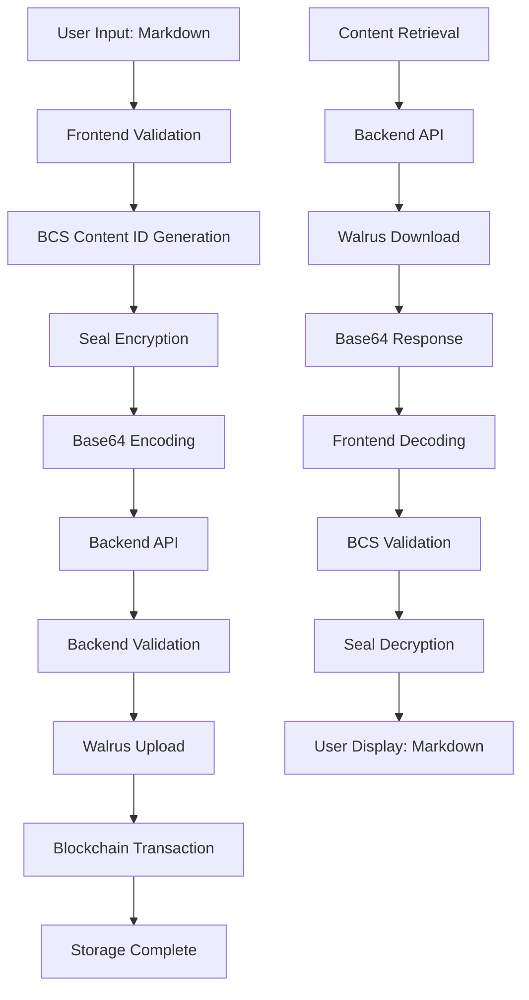

# Complete Data Flow Documentation

## Overview

This document provides comprehensive documentation for the entire data pipeline from frontend markdown conversion through backend storage and retrieval, ensuring proper BCS/Mysten utility usage and no data corruption throughout the process.

## Data Flow Architecture



## 1. Frontend Encryption Pipeline

### 1.1 Input Processing
**Location**: `useArticleCreation.ts`, `DataPipelineService.ts`

```typescript
// Data Flow: Raw Markdown → Validated Content
const validationResult = validationService.validateMarkdownContent(content);
if (!validationResult.isValid) {
  throw new Error(`Content validation failed: ${validationResult.errors.join(', ')}`);
}
```

**Validation Steps**:
- UTF-8 encoding validation
- Content length bounds checking (10 chars - 1MB)
- Markdown format detection
- Control character detection

### 1.2 Content ID Generation
**Location**: `seal-identity.ts`

```typescript
// Data Flow: Markdown + Publication ID → BCS-Encoded Content ID
const contentId = generateArticleContentId(publicationId, articleTitle);
const contentIdHex = contentIdToHex(contentId);

// BCS Structure: tag(1) + version(2) + address(32) + nonce(8) = 43 bytes
const IdV1Layout = bcs.struct('IdV1', {
  tag: bcs.u8(),           // 0 for article content
  version: bcs.u16(),      // 1 for V1
  publication: bcs.Address, // Sui address (32 bytes)
  nonce: bcs.u64(),        // Timestamp-based nonce
});
```

**Key Points**:
- Uses deterministic BCS encoding matching smart contract
- Content ID is 43 bytes (86 hex characters + 0x prefix)
- Includes publication context for access control

### 1.3 Seal Encryption
**Location**: `SealServiceEnhanced.ts`

```typescript
// Data Flow: Content + Content ID → Encrypted Bytes
const encryptedData = EncryptedObject.serialize({
  id: contentIdHex,
  data: contentBytes
});
```

**Process**:
1. Convert markdown string to UTF-8 bytes
2. Create EncryptedObject with content ID and data
3. Serialize using BCS encoding
4. Return encrypted Uint8Array

### 1.4 Base64 Encoding for Transport
**Location**: `DataPipelineService.ts`

```typescript
// Data Flow: Encrypted Uint8Array → Base64 String
import { toBase64 } from '@mysten/bcs';
const encryptedContentBase64 = toBase64(encryptedData);
```

**Critical Fix**:
- ✅ **FIXED**: Now uses `toBase64()` from `@mysten/bcs`
- ❌ **PREVIOUS**: Used `String.fromCharCode()` + `btoa()` which corrupted BCS bytes
- **Result**: Proper binary-to-Base64 conversion preserving data integrity

## 2. Backend Upload Pipeline

### 2.1 API Reception
**Location**: `articles.controller.ts`

```typescript
// Data Flow: HTTP Request → Validated DTO
@Post('create')
async createArticle(@Body() createArticleDto: CreateArticleDto) {
  // Input validation and processing
}
```

**Headers**: `Content-Type: application/json`

### 2.2 Backend Validation
**Location**: `articles.service.ts`

```typescript
// Data Flow: Base64 String → Validation → Buffer → Uint8Array
private validateEncryptedContent(dto: CreateArticleDto): void {
  // Validate Base64 format
  try {
    Buffer.from(dto.content, 'base64');
  } catch (error) {
    throw new BadRequestException('Encrypted content must be valid base64 encoded data');
  }
}
```

**Validation Steps**:
- Base64 format validation
- Content ID format verification (hex with 0x prefix)
- Encryption metadata validation
- Content length bounds checking

### 2.3 File Preparation for Walrus
**Location**: `articles.service.ts`

```typescript
// Data Flow: Base64 String → Buffer → Uint8Array → WalrusFile
private prepareFilesForUpload(dto: CreateArticleDto) {
  files.push({
    content: fromBase64(dto.content), // Direct BCS conversion
    identifier: 'article',
    tags: {
      'content-type': 'text/markdown',
      'article-title': dto.title,
      'is-gated': dto.isGated ? 'true' : 'false',
    },
  });
}
```

**Key Enhancement**:
- ✅ **UPDATED**: Now uses `fromBase64()` from `@mysten/bcs`
- **Result**: Direct conversion from Base64 to Uint8Array without corruption

### 2.4 Walrus Upload
**Location**: `walrus.service.ts`

```typescript
// Data Flow: Uint8Array → WalrusFile → Walrus Storage
const walrusFiles = files.map((fileData) => {
  return WalrusFile.from({
    contents: fileData.content, // Direct Uint8Array pass-through
    identifier: fileData.identifier,
    tags: fileData.tags,
  });
});

const result = await walrusClient.writeFiles({
  files: walrusFiles,
  epochs: options.epochs || 5,
  deletable: options.deletable || false,
  signer,
});
```

**No Data Manipulation**:
- Uint8Array passed directly to Walrus client
- No string conversions or transformations
- Binary data preserved throughout upload

## 3. Backend Download Pipeline

### 3.1 Walrus Download
**Location**: `walrus.service.ts`

```typescript
// Data Flow: Walrus Storage → Uint8Array
async downloadQuilt(blobId: string): Promise<Map<string, Uint8Array>> {
  const quilt = await walrusClient.getBlob({ blobId });
  const files = await quilt.files();
  
  for (const file of files) {
    const content = await file.bytes(); // Returns Uint8Array directly
    results.set(identifier, content);   // Store pristine Uint8Array
  }
}
```

**Direct Binary Retrieval**:
- Walrus returns Uint8Array natively
- No string conversions in backend
- Binary data integrity maintained

### 3.2 API Response
**Location**: `articles.controller.ts`

```typescript
// Data Flow: Uint8Array → HTTP Response
@Get('raw/:quiltBlobId')
async getRawArticleContent(@Param('quiltBlobId') quiltBlobId: string, @Res() res: Response) {
  const rawContent = await this.articlesService.getArticleRawContent(quiltBlobId);
  
  res.setHeader('Content-Type', 'application/octet-stream');
  res.setHeader('Content-Length', rawContent.length);
  res.send(Buffer.from(rawContent)); // Uint8Array → Buffer for HTTP
}
```

**HTTP Binary Transmission**:
- Proper binary content headers
- Clean Uint8Array to Buffer conversion for HTTP
- No data corruption at HTTP boundary

## 4. Frontend Decryption Pipeline

### 4.1 Content Download
**Location**: `useArticle.ts`, `DataPipelineService.ts`

```typescript
// Data Flow: HTTP Response → Uint8Array
async downloadEncryptedContent(quiltBlobId: string): Promise<Uint8Array> {
  const response = await articlesAPI.getRawContent(quiltBlobId);
  
  let encryptedData: Uint8Array;
  if (response.data instanceof ArrayBuffer) {
    encryptedData = new Uint8Array(response.data);
  } else if (response.data instanceof Uint8Array) {
    encryptedData = response.data;
  } else if (typeof response.data === 'string') {
    encryptedData = fromBase64(response.data); // BCS-compliant conversion
  }
  
  return encryptedData;
}
```

**Response Format Handling**:
- Supports multiple response formats (ArrayBuffer, Uint8Array, Base64 string)
- Uses `fromBase64()` for string responses
- Preserves binary data integrity

### 4.2 BCS Validation
**Location**: `useArticle.ts`, `ValidationService.ts`

```typescript
// Data Flow: Uint8Array → BCS Validation → Parsed Object
try {
  const encObj = EncryptedObject.parse(params.encryptedData);
  console.log('✅ BCS validation successful. Content ID:', encObj.id);
  
  // Verify content ID match
  if (article.contentSealId && encObj.id !== article.contentSealId) {
    console.warn('⚠️ Content ID mismatch:', {
      fromDatabase: article.contentSealId,
      fromEncryptedObject: encObj.id
    });
  }
} catch (parseError) {
  console.error('❌ BCS validation failed:', parseError);
  throw new Error('Invalid encrypted content: BCS parsing failed.');
}
```

**Validation Steps**:
- Parse BCS-encoded EncryptedObject
- Verify content ID consistency
- Validate data payload structure
- Detect corruption early in pipeline

### 4.3 Seal Decryption
**Location**: `SealServiceEnhanced.ts`

```typescript
// Data Flow: Validated Uint8Array → Decrypted Content
static async decryptContent(params: DecryptionInput): Promise<string> {
  // Validate BCS structure
  const encObj = EncryptedObject.parse(params.encryptedData);
  
  // Decrypt content (mock implementation)
  const decryptedContent = new TextDecoder().decode(encObj.data);
  
  return decryptedContent;
}
```

**Process**:
1. Parse encrypted object to verify structure
2. Extract encrypted data payload
3. Decrypt using Seal protocol (when integrated)
4. Convert decrypted bytes to UTF-8 string

## 5. Data Integrity Verification Points

### 5.1 Frontend Encryption Validation
```typescript
// Validate encryption result
const validationResult = SealValidation.validateEncryptedObject(encryptedData, contentIdHex);
if (!validationResult.isValid) {
  throw new Error(`Encryption validation failed: ${validationResult.errors.join(', ')}`);
}
```

### 5.2 Backend Upload Validation
```typescript
// Validate encrypted content structure
private validateEncryptedContent(dto: CreateArticleDto): void {
  // Base64 format validation
  try {
    Buffer.from(dto.content, 'base64');
  } catch (error) {
    throw new BadRequestException('Encrypted content must be valid base64 encoded data');
  }
}
```

### 5.3 Frontend Download Validation
```typescript
// BCS validation before decryption
const bcsValidation = this.validateBCSStructure(params.encryptedData, params.contentId);
if (!bcsValidation.isValid) {
  throw new Error(`BCS validation failed: ${bcsValidation.errors.join(', ')}`);
}
```

## 6. Error Handling and Recovery

### 6.1 Validation Errors
- **Content validation failures**: User-friendly messages with specific issues
- **BCS parsing errors**: Technical details with corruption indicators
- **Format errors**: Clear guidance on expected formats

### 6.2 Network Errors
- **Upload failures**: Retry with exponential backoff
- **Download timeouts**: Connection guidance and retry options
- **API errors**: Status-specific error messages

### 6.3 Encryption/Decryption Errors
- **Key server issues**: Service availability messages
- **Authentication failures**: Wallet connection guidance
- **Access control**: Permission-specific messages

## 7. Performance Considerations

### 7.1 Data Size Optimization
- **Content Limits**: 1MB maximum content size
- **Compression**: Walrus handles data compression
- **Chunking**: Large files processed in chunks

### 7.2 Validation Efficiency
- **Early Validation**: Fail fast on invalid inputs
- **Cached Results**: Reuse validation results when possible
- **Parallel Processing**: Validate multiple components concurrently

### 7.3 Memory Management
- **Stream Processing**: Use streams for large files
- **Buffer Cleanup**: Properly dispose of temporary buffers
- **Error Cleanup**: Clear resources on failures

## 8. Security Considerations

### 8.1 Data Protection
- **No Logging**: Sensitive data never logged
- **Memory Clearing**: Sensitive buffers cleared after use
- **Transport Security**: HTTPS for all API calls

### 8.2 Validation Security
- **Input Sanitization**: All inputs validated and sanitized
- **Format Verification**: Strict format checking
- **Size Limits**: Prevent DoS through large uploads

### 8.3 Access Control
- **Authentication**: JWT tokens for API access
- **Authorization**: Wallet-based content access
- **Content Gating**: Seal-based access control

## 9. Monitoring and Debugging

### 9.1 Logging Strategy
- **Structured Logging**: JSON format with correlation IDs
- **Error Tracking**: Comprehensive error context
- **Performance Metrics**: Processing times and success rates

### 9.2 Debugging Tools
- **Validation History**: Track validation results over time
- **Data Flow Tracing**: Follow data through each pipeline stage
- **Error Analysis**: Categorized error reporting

### 9.3 Health Checks
- **Pipeline Status**: Monitor each stage health
- **Service Dependencies**: Walrus and blockchain connectivity
- **Data Integrity**: Regular corruption checks

## 10. Migration and Compatibility

### 10.1 Data Format Evolution
- **Backward Compatibility**: Support for legacy formats
- **Migration Scripts**: Convert old data to new formats
- **Version Detection**: Identify data format versions

### 10.2 API Versioning
- **Version Headers**: API version specification
- **Deprecation Notices**: Clear migration timelines
- **Breaking Changes**: Coordinated frontend/backend updates

This documentation provides a complete picture of how data flows through the entire system, ensuring proper handling and no corruption at any stage of the pipeline.